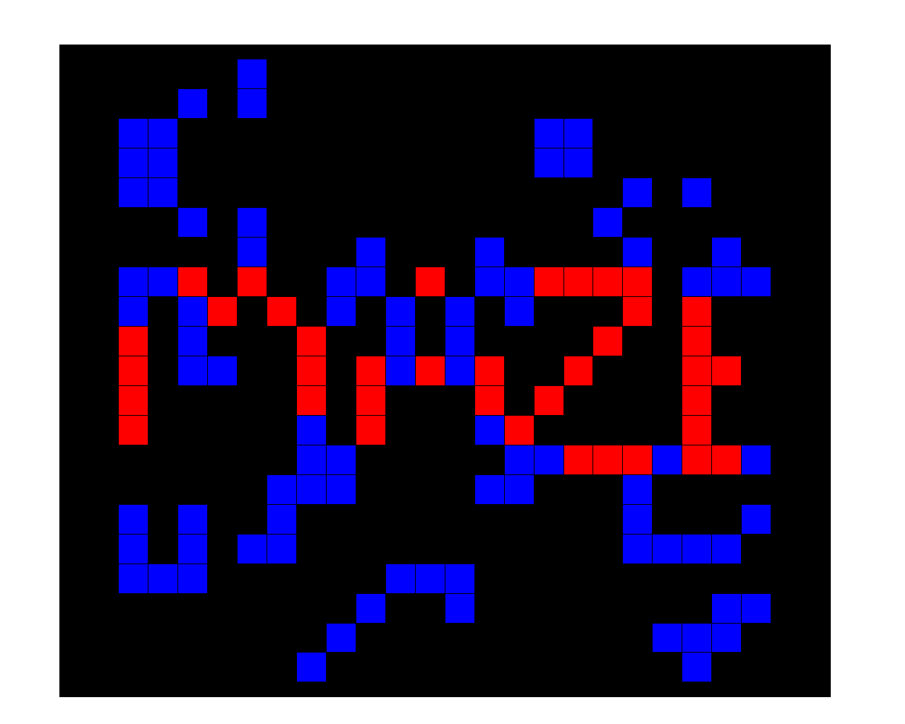

# Deobfuscating Maze's Control Flow Obfuscations

## Further Reading
* [A Malware Researcher's Guide to Reversing Maze](https://labs.bitdefender.com/2020/03/a-malware-researchers-guide-to-reversing-maze/) by Mihai Neagu (@mneagu8d) and Bogdan BOTEZATU (@bbotezatu)
    * Leverages IDA's Processor Module Extensions